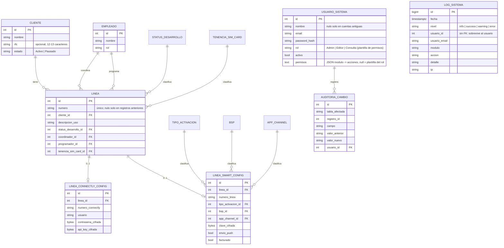

# Diagrama ER — SoulChat Inventario Líneas

El SQL de referencia (3FN) vive en la memoria del proyecto y se refleja 1:1 en la migración
`SoulChat.Infrastructure/Persistence/Migrations/20260917224304_InitialCreate.cs`.

La migración `AgregaNombreUsuarios` añade `usuarios_sistema.nombre` (nulo en cuentas existentes; la cuenta sembrada
`admin@soulchat.local` recibe el nombre "Administrador").

La migración `AgregaNumeroLineaClientesLogsYPermisos` añade `lineas.numero` (con índice único), `clientes.rfc` y
`clientes.estado`, `usuarios_sistema.permisos` y la tabla `logs_sistema`. Es aditiva: las filas existentes se conservan
(clientes quedan `Activo`; líneas sin `numero` hasta que se les asigne uno).
